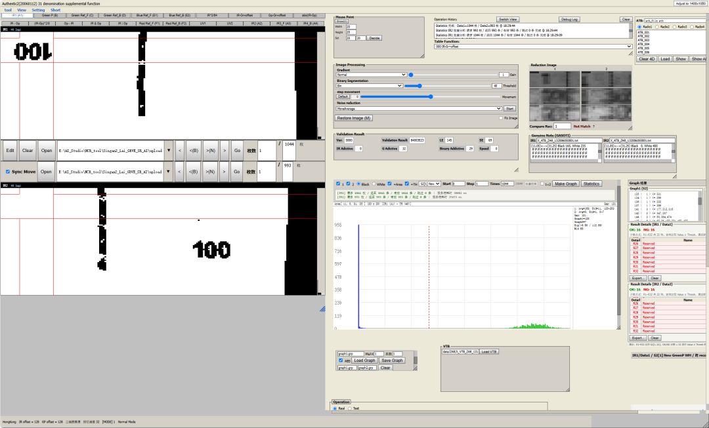

# Singan2 (GBVE / SR) — 重构工程

SINGAN2 算法的现代化重构版本：纯 C++17 算法核心 + HTTP API + Web 前端（React/ECharts）。
目标：**脱离原 VC6/Win32 MFC 工程**，跨平台、可测试、可远程调用。

> 算法正确性以 `poc/`（Python 参考实现）为基准；`poc/output/` 下的产物作为 C++ 对拍的 golden。



## 阶段状态

| 阶段 | 内容 | 状态 |
|------|------|------|
| POC 验证 | poc 算法层输出 vs `expected_kin1.json` | ✅ 通过（record 0 全 32 项一致） |
| M1 解析层 | `mariner_reader` + `readzfile` C++ 移植 + 对拍 | ✅ 通过 |
| M2 算法核心 | `imageops` + `wtable` + `c_si2` + `all32` C++ 移植 | ✅ 通过（`run_algorithm` 输出与 poc golden 逐项一致） |
| M3 HTTP API | C++ HTTP server（cpp-httplib）暴露算法 | ✅ 通过（`server/smoke_test.py` 全 PASS） |
| M4 Web 前端 | React + ECharts 调用 API（1:1 复刻原版 MFC 主界面） | ✅ 完成（P0–P5 全链路 + ATB 面板真实移植 + Graph 操作区 + 本地文件选择对话框） |
| M5 批量统计 | Statistics / Make Graph 批量多 record 并行计算 + Result Details + S2Chart 跨 record 曲线 | ✅ 完成（服务端线程池并行；Make Graph 支持 4 种测量方法） |

## 最近更新（v0.6.0，2026-09-03）

- **ATB 面板真实移植（P4）**：`/api/atb/load|area|update|ctb`，ATB/SRU 二进制格式（128×512×8B；SRU=32B 头+256×1024×8B），area 切换、条目编辑整表写回、Show/Show All 彩色叠加、Set 4D 公式、CTB 面额尺寸。
- **本地文件选择对话框**：`GET /api/fs/list` + `FileBrowser` 组件（目录单击进入、`..` 上级、路径可手输），ATB/CTB/GPH 三处共用。
- **Graph 操作区 1:1 重建**：测量方法列表（`IDC_LIST_GRAPH_FUNS`）、原版 .GPH 二进制存取（`/api/graph/gph-save|load`，9400B）、Combine 多文件累加；Mul-X/ABS 为原版死控件（TBD），面板内附说明。
- **性能**：Make Graph 7s→2s（批量提取+单波快速路径）、整通道预载「秒载 1000 张」、毫秒级后端日志 + LogViewer。详见 `docs/优化与构建说明.md` 与 `docs/11_模块功能同步方案_P0-P5.md`。

## 目录结构

```
Singan2_Lai_GBVE_SR_AI/
├── core/                     # C++ 算法核心（C++17）
│   ├── include/singan2/     # 公共头 (types.h, mariner_reader.h, readzfile.h, ...)
│   └── src/                 # 实现
├── server/                  # HTTP API（M3，cpp-httplib）
├── web/                     # React 前端（M4，Vite + ECharts）
│   └── src/components/      # 30+ 个 UI 组件（绝对定位 1:1 复刻，含 Graph 结果面板 / S2Chart / IR1+IR2 双文件）
├── tests/                   # 对拍测试 (test_parse.cpp)
├── poc/                     # Python 参考实现 + golden 输出
│   ├── parse/  algo/  tools/
│   └── output/              # golden (global_onedat_rec0.bin, areas.json, s2_result_rec0.json, ...)
├── data/                    # 数据文件 (.dat, 坐标 txt, .bin)
├── docs/                    # 项目架构 / 流程 / 界面交互 / 对拍指南等（中文 markdown）
├── third_party/             # 第三方依赖（如 cpp-httplib 头文件）
├── build/                   # CMake 构建目录（生成，已忽略）
├── CMakeLists.txt           # 顶层
├── build_core.bat           # 一键构建 core
├── run_all.bat / stop_all.bat # 启动 / 停止 server + web 开发服务器
└── README.md
```

## 构建

需要：CMake ≥ 3.20、MSVC (VS2022) 或任意 C++17 编译器。

```bash
cmake -S . -B build -G "Visual Studio 17 2022" -A x64
cmake --build build --config Debug
```

> **x64 陷阱**：若 `build/` 曾用 Win32 配置过，重配 x64 会报 "platform used previously" 冲突，
> 需先 `Remove-Item -Recurse -Force build` 再重新 `cmake -S . -B build -A x64`。

## HTTP API（P0–P5）

`server/server.cpp`（cpp-httplib）暴露的端点，**web 前端 `web/src/api.js` 一一对应**：

| 方法 | 路径 | 阶段 | 说明 |
|------|------|------|------|
| GET  | `/health` | — | 健康检查 |
| POST | `/api/session/open` | P0 | 打开 .dat，返回 `record_count / wave_count / waves` |
| POST | `/api/upload` | P0 | 流式上传本地 .dat 到服务器 `uploads/`（避免大文件整体入内存） |
| POST | `/api/image` | P0 | 取单波段图像（raw / 2byte / intermediate） |
| POST | `/api/small-image` | P0 | 取小图（SMALL_SIZE） |
| POST | `/api/analyze-path` | P1 | 按路径分析单 record |
| POST | `/api/analyze-batch` | P1 | 批量分析（Statistics / Make Graph 用）：单文件多 record 一次请求，服务端线程池并行 |
| POST | `/api/analyze` | P1 | multipart 上传文件分析 |
| POST | `/api/imageops` | P2 | 对记录/波段应用算子（gradient / niti / smooth …） |
| POST | `/api/graph/make` | P3 | 生成图表序列，复刻 CreateGraph1 + ComputeSuppleResult；`result_method` 选测量方法（0=黑/白像素数 1=黑/白水平跨度 2/4=TBD 3=相邻差分>阈值累加） |
| POST | `/api/graph/combine` | P3 | 序列合成（diff / max / min / avg） |
| POST | `/api/graph/save` | P3 | 保存 .grp（JSON 文本） |
| POST | `/api/graph/load` | P3 | 读取 .grp |
| POST | `/api/graph/gph-save` | P3 | 保存原版 .GPH 二进制（head[100]+series1/2 各 2300 u16） |
| POST | `/api/graph/gph-load` | P3 | 读取原版 .GPH 二进制（Load Graph/Combine 用） |
| POST | `/api/zfile/parse` | P4 | 解析坐标文件（shift_jis） |
| POST | `/api/atb/load` | P4 | 加载 ATB（SRU 自动探测），返回 area 名单 + area#0 列表与原始字节 |
| POST | `/api/atb/area` | P4 | 切换 ATB area（对应原版类型下拉） |
| POST | `/api/atb/update` | P4 | 更新 ATB 条目（8 字节）并整表写回文件（SRU 保留原 32B 头） |
| POST | `/api/atb/ctb` | P4 | 解析 CTB 面额尺寸列表（Load Size...） |
| GET  | `/api/fs/list` | P4 | 本地目录列表（`?path=&ext=`），供前端文件选择对话框（等价 GetOpenFileName） |
| POST | `/api/vtb/load` | P4 | 加载 VTB |
| GET  | `/api/debug-log` | — | 读取后端调试日志 `singan2_debug.log`（供前端日志查看器） |
| POST | `/api/export/csv` | P5 | 导出 CSV |
| POST | `/api/config/save` | P5 | 保存配置 |
| POST | `/api/config/load` | P5 | 读取配置 |

冒烟测试（需先启动 `singan2_server.exe` 监听 `:8080`）：

```bash
python server/smoke_test.py
```

> 批量分析 `/api/analyze-batch` 入参：`{ dat_path, zfile_path, start, step, count, kin, country }`；
> 返回 `{ count, record_count, results:[{ record, s2:[32], etc:[12], error }] }`。服务端按 `available = max(1, (record_count-1-start)/step + 1)` 截断 `count`，并用线程池并行计算，失败记录写入 `error` 字段而非中断整批。

## Web 前端（M4）

```bash
cd web
npm install
npm run dev          # Vite 开发服务器 @ :5173（已配 /api -> :8080 代理）
npm test             # Vitest 全量测试（38 文件 / 198 用例，全部通过）
```

### Web 布局约束（重要）

原版为 Win32/MFC（`Singan2_Lai_GBVE_SR_OLD` 工程），Web 端按 **1:1 像素级** 复刻其主界面（2026-09-03 起用户已放宽整体尺寸）：

- 主窗口 `.main-window`：`2400 × 1450` 基准（支持右下角手柄等比缩放）
- **左侧画布 `.main-canvas`：宽 `900` 锁定**（禁止改动）
- **右侧区 `.right-area`：`left:1100; top:44; width:1300; height:1356`**
- 右侧各面板为 `.rc` 容器：**位置由 `RC` 组件的 `dl/dt` props 决定**（CSS left/top 仅为文档），用户拖拽后持久化到 `localStorage(rcpos:<id>)`，改默认位置必须改 `dl/dt`
- 面板内部换算：`left = (rcX − 613) × 1.201`、`top = rcY × 1.337`
- UI 还原的权威依据：`Singan2_Lai_GBVE_SR_OLD` 的 `resource.rc` 与 `WinMain.cpp`（控件文字 / ID / 坐标），而非截图；功能语义以 OLD 源码为准（如 `ComputeSuppleResult` 测量方法、Mul-X/ABS 为死控件）。

## 测试（对拍验证）

解析层对拍：用原始数据文件 + poc 生成的 golden 验证 C++ 实现一致性。

```bash
# 先确保 poc/output 是最新的（用当前 data 重新生成）
cd poc && python run_poc.py --dat ../data/2A_DA_111017_115542.dat \
                            --zfile ../data/ZAR/X_ATB_ZAR_132006050001.txt \
                            --record 0 --out output

# 运行 C++ 对拍
./build/tests/Debug/test_parse.exe \
    ../data/2A_DA_111017_115542.dat \
    ../data/ZAR/X_ATB_ZAR_132006050001.txt \
    ../poc/output
# 期望: [1] extract_mm1_side: PASS  [2] parse_zfile: PASS
```

前端回归（Vitest）：

```bash
cd web && npm test        # ✅ 38 文件 / 198 用例全部通过
```

## 编码约定

- 纯 C++17，无外部运行时依赖（图像运算自实现，避免 OpenCV 重依赖）
- 所有魔法数字提取为 `core/include/singan2/types.h` 中的常量
- 每个模块以 `poc/` 对应 Python 模块为基准，输出须与 golden 逐字节/逐项一致
- 关键函数配单元测试（对拍 golden）
- 前端组件须"自给自足"（内置默认值），可无 props 直接 `render(<X/>)` 测试

## 发布说明

- 仓库默认分支：`main`（原 `master` 已本地改名对齐）。
- 完整工程已通过 GitHub API（Blob/Tree/Commit）上传至 `main`，commit 含全部源码、数据样本、文档。
- 已知限制：单个 GitHub blob ≤ 25MB，**超大会话导出 JSON（>150MB）不参与上传**，按需用 Git LFS 或拆分归档。
- `.gitignore` 已排除 `node_modules/`、`build/`、`dist/`、`.codebuddy/`、`*.pyc`、`*.test.*`、`tests/`、`uploads/`、`data/*.dat`（运行期上传/样本大体积二进制）等大体积 / 生成物；仓库只保留源码、文档与小型样本。
- 本地 git 直连 GitHub（443）在部分网络环境下不稳定时，可复用 GitHub REST API 方式同步。
